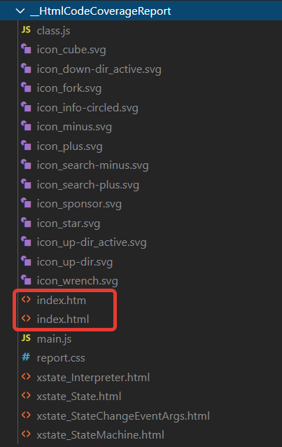

 

 

# XStateNet

.NET implementation of the finite state machine framework. Powerful and asynchronous framework to build and run finite state machines in .NET.

# Main Features

1. Declarative state machine building and running in asynchronous mode, with awaiting or without (non blocking the main thread);
2. States can execute delegate with callback to generate multiple events and have various state switch transitions, as well as asynchronous actions to switch state on action done or error; Each service can execute also another state machine and move to another state on machine done or error;
3. Side effects for each state: actions on state enter, on state exit. Activities - long running awaitable and task with cleanup method that runs while machine is in the certain state but that action can't affect state machine.
4. Additional service types and modes for state: transient state, timeout service, final state;

# Documentation

[Read Wiki pages here](https://github.com/serge-sedelnikov/xstate.net/wiki)

# Nuget Package

Find the Nuget package here:

[https://www.nuget.org/packages/XStateNet](https://www.nuget.org/packages/XStateNet)

The library is targeted for `netstandard2.0` and for `net5.0`, feel free to comment or open an issue in case any other compatibility is needed. Those two target frameworks should cover most of the development needs.


# Main Classes

## State

The main state class, compose the class with chained methods to fill it with services, actions or activities.

- Services are methods that are executed and their goal is to change the state machine state;
- Actions are "fire and forget" methods that are running on state is entered and/or on state is exited. This is a good place to do some initialization and cleanup work.
- Activities are long running methods that can do any long running parallel work together with services but they can't affect state machine state.

## StateMachine

The state machine class, that has a collection of states and initial state to start execution from.

## Interpreter

The state machine interpreter or the state machine runner, the main goal of this class instance is to start state machine execution.

It can await until state machine is done, or subscribe for event in case the state machine is started in the background thread without using awaitable start method.

# Examples

## Traffic Light

Simple example that uses callback services and no side effects.

First, add namespace using directives:

```cSharp
using XStateNet;
```

Then you can use classes from the library.

```cSharp
// create all needed states for traffic light
State redLight = new State("redLight");
State amberLight = new State("amberLight");
State greenLight = new State("greenLight");
State errorBlinkingAmber = new State("error");
bool isError = false;
int fixAttempt = 1;

// define services with callbacks.
// callback can trigger a certain event, and according to the event
// and registered transition, state machine is then switched to another state
redLight.WithInvoke(async (callback) => {
    Console.WriteLine("RED LIGHT!!! STOP!");
    await Task.Delay(1000); // emulate traffic light delay
    // check error
    if(isError)
    {
        // if traffic light has error, emit ERROR event
        await callback("ERROR");
    }
    else
    {
        // is not, emit success event
        await callback("RED_LIGHT_FINISHED");
    }
})
// add transition, in case of ERROR event, move to error state,
// in case of RED_LIGHT_FINISHED move to amber light
// if no transition is registered, no exception is thrown, as we can reuse same services in different scenarios.
.WithTransition("ERROR", "error")
.WithTransition("RED_LIGHT_FINISHED", "amberLight");

// fill up amber state.
// here we use different service type: async action with cancellation token
amberLight.WithInvoke(async (cancel) => {
    Console.WriteLine("Amber light! Attention!");

    // as state can run multiple services at parallel, if another service switches the state of the state machine
    // the cancellation token is then canceled, and you need to check it in your
    // buiseness logic.
    await Task.Delay(3000, cancel);

    // when async task is done, it moves to the "greenLight" state, in case of error to the third
    // argument state, which is in our case is "error"
    // both of them can be null if you don't need to swich state, for instance in Final state case.
    // if onErrorTargetStateId argument is null, then the error is thrown if it happens.
}, "greenLight", "error"); 

// fill up green state, easy timeout, no services but only an indicator
// where to move the state machine after certain time
greenLight.WithTimeout(5000, "redLight")
.WithActionOnEnter(() => {
    Console.WriteLine("Green light! Go go go!");
})
.WithActionOnExit(() => {
    // each time we exit green light, emulate error in the traffic light
    // 50% chance for demo only
    isError = new Random().NextDouble() > 0.5;
});

// error state
errorBlinkingAmber.WithInvoke(async (callback) => {
    Console.WriteLine("Error in the traffic light!");
    Console.WriteLine($"Trying to fix... Attempt #{fixAttempt}");
    await Task.Delay(1000);
    isError = new Random().NextDouble() > 0.5;
    if(isError)
    {
        Interlocked.Increment(ref fixAttempt);
        await callback("COULD_NOT_FIX");
    }
    else
    {
        Interlocked.Exchange(ref fixAttempt, 1);
        await callback("ERROR_FIXED");
    }
})
// register transitions, if we could not fix, repeat the same state
// if we fixed, move to red light
.WithTransition("COULD_NOT_FIX", "error")
.WithTransition("ERROR_FIXED", "redLight");

// once all states are defined, create state machine and interpreter
// define ID, name and initial state ID for the machine
StateMachine machine = new StateMachine("myTrafficLight", "My traffic light machine", redLight.Id);
// set states, order does not matter
machine.States = new []
{
    redLight, amberLight, greenLight, errorBlinkingAmber
};
// create interpreter and start the state machine
Interpreter interpreter = new Interpreter(machine);
interpreter.StartStateMachine();
// also can be awaitable if you need to run it in background thread
// await interpreter.StartStateMachineAsync();
```

The console output is as expected:

```
RED LIGHT!!! STOP!
Amber light! Attention!
Green light! Go go go!
RED LIGHT!!! STOP!
Amber light! Attention!
Green light! Go go go!
RED LIGHT!!! STOP!
Amber light! Attention!
Green light! Go go go!
RED LIGHT!!! STOP!
Amber light! Attention!
Green light! Go go go!
RED LIGHT!!! STOP!
Error in the traffic light!
Trying to fix... Attempt #1
RED LIGHT!!! STOP!
Amber light! Attention!
Green light! Go go go!
```

Notice, that there was an error state switch and one attempt to fix error. State machine works as expected.

> More examples: look at the documentation or in the "demo-console-app" folder.

# Good practice

It would be better not to use inline methods if the state machine is complex. You can use `State` as a base class, inherit your own class from it, and use the construct chain methods in the class constructor, for example, to build a class.

Example:

```cSharp
class ShowingRedLight : State
{
    public ShowingRedLight() : base("showingRedLight")
    {
        // wait for the red light timer
        this.WithInvoke(WaitForRedLightTimer);
        // show the red light picture
        this.WithActionOnEnter(ShowRedLight);
    }

    /// <summary>
    /// Turns on the red light.
    /// </summary>
    private void ShowRedLight()
    {
        Helper.DrawTrafficLight(Helper.Mode.Red);
    }

    /// <summary>
    /// Waits for the timer to switch to next state.
    /// </summary>
    /// <param name="state"></param>
    /// <param name="callback"></param>
    private async Task WaitForRedLightTimer(CallbackAction callback)
    {
        await Task.Delay(1000);
        await callback("RED_LIGHT_DONE");
    }
}
```

# Manual Build

In case you don't want to use Nuget package, you can manually build the library for Debug or Release.

Navigate to the folder `XStateNet`, run

```sh
dotnet build
```

or for Release build

```sh
dotnet build -c Release
```

The only library you need to reference to your project is `XStateNet.dll`. Depending on your project target, reference the correct target framework built dll.


# Test

The the root project folder, run

```sh
dotnet test
```

or for verbose results (normal level of console output)

```sh
dotnet test -v n
```

# Generate Test Coverage HTML

Open terminal in the project root directory. First, collect XPlat Code Coverage into XML file.

> To collect code coverage on any platform that is supported by .NET Core, install [Coverlet](https://github.com/coverlet-coverage/coverlet/blob/master/README.md) and use the --collect:"XPlat Code Coverage" option.

```sh
dotnet test --collect:"XPlat Code Coverage"
```

This will generate the XML file with cobertura format under `NetState.Tests` -> `TestResults` -> `<guid>` -> `coverage.cobertura.xml` file.


Second, if you don't have `reportgenerator` tool for dotnet, install it globally.

```sh
dotnet tool install -g dotnet-reportgenerator-globaltool
```

Then you can generate HTML files to browse the code coverage:

```sh
reportgenerator "-reports:NetState.Tests\TestResults\<guid>\coverage.cobertura.xml" "-targetdir:__HtmlCodeCoverageReport" -reporttypes:Html
```

> Note! replace `<guid>` with the GUID that was generated by the test coverage XML generator.

This will create the HTML report, which you can browse in your internet explorer.



Open `index.htm` or `index.html` in your browser.


